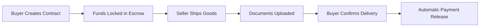

# Lisk Escrow Platform - Pitch Deck Guide

## 🎯 Executive Summary

**Lisk Escrow** is a blockchain-based escrow platform that revolutionizes international trade by providing secure, transparent, and gasless payment solutions for cross-border transactions.

### One-Liner
"Making international trade as simple and secure as local transactions through blockchain-powered escrow."

### Key Value Proposition
- **Trust without intermediaries** - Smart contracts replace traditional banks
- **90% lower fees** - Gasless transactions eliminate blockchain complexity
- **Instant settlements** - No more 3-5 day wire transfers
- **Complete transparency** - Every step tracked on-chain

---

## 🔥 Problem Statement

### The $19 Trillion Problem
International trade represents $19 trillion annually, yet businesses face:

1. **Trust Issues**
   - 58% of SMEs have experienced payment fraud in international trade
   - No guarantee of payment after shipping goods
   - No assurance of delivery after payment

2. **High Costs**
   - Traditional escrow services charge 1-3% fees
   - International wire transfers cost $45-65 per transaction
   - Currency conversion fees add another 2-4%

3. **Slow Processes**
   - Bank transfers take 3-5 business days
   - Document verification is manual and slow
   - Dispute resolution can take weeks

4. **Complexity**
   - Multiple intermediaries (banks, escrow agents, lawyers)
   - Extensive paperwork and compliance requirements
   - Different regulations across countries

---

## 💡 Solution

### How Lisk Escrow Works



### Key Features

1. **Smart Contract Escrow**
   - Funds are locked in a decentralized smart contract
   - Automatic release upon delivery confirmation
   - No middleman can access or freeze funds

2. **Gasless Transactions**
   - Users pay zero blockchain fees
   - Email-based onboarding (no crypto wallet required initially)
   - Relayer network handles gas costs

3. **Document Management**
   - On-chain document hashes for proof
   - Off-chain storage via Supabase for privacy
   - Immutable audit trail

4. **Real-time Tracking**
   - GraphQL-powered dashboard
   - Instant status updates
   - Complete transaction history

---

## 🏗️ Technical Architecture

### Tech Stack
- **Blockchain**: Lisk L2 (Ethereum-compatible)
- **Smart Contracts**: Solidity with OpenZeppelin
- **Frontend**: Next.js 14, TypeScript, TailwindCSS
- **Indexing**: Ponder (GraphQL API)
- **Gasless**: Custom relayer service
- **Storage**: Supabase (documents & user data)

### Architecture Diagram

```
┌─────────────────┐     ┌─────────────────┐     ┌─────────────────┐
│                 │     │                 │     │                 │
│   Next.js App   │────▶│  Relayer API   │────▶│ Smart Contract  │
│                 │     │                 │     │                 │
└────────┬────────┘     └─────────────────┘     └────────┬────────┘
         │                                                │
         │              ┌─────────────────┐               │
         └─────────────▶│  Ponder Index   │◀──────────────┘
                        │   (GraphQL)     │
                        └─────────────────┘
```

### Smart Contract Features
- **EIP-712 Typed Signatures** for gasless transactions
- **ReentrancyGuard** for security
- **Role-based permissions** (buyer, seller, arbiter)
- **Time-locked escrows** with deadlines
- **Multi-document support** for shipping papers

---

## 📊 Market Opportunity

### Total Addressable Market (TAM)
- **Global B2B E-commerce**: $7.7 trillion (2023)
- **Cross-border Trade**: $19 trillion annually
- **SME International Trade**: $2.3 trillion

### Serviceable Addressable Market (SAM)
- **Digital Trade Transactions**: $850 billion
- **High-risk Trade Corridors**: $320 billion
- **SME Cross-border Payments**: $180 billion

### Target Market
1. **Small-Medium Importers/Exporters**
   - Currently underserved by banks
   - Need affordable escrow solutions
   - Value simplicity and transparency

2. **E-commerce Platforms**
   - Marketplace integration opportunities
   - White-label escrow services
   - API-first approach

3. **Freight Forwarders**
   - Document management needs
   - Payment guarantee requirements
   - Multi-party coordination

---

## 💰 Business Model

### Revenue Streams

1. **Transaction Fees**
   - 0.5% of transaction value (vs 1-3% traditional)
   - Minimum fee: $10
   - Maximum fee: $500

2. **Premium Features**
   - Priority dispute resolution
   - Advanced analytics dashboard
   - API access for high-volume users

3. **Enterprise Solutions**
   - White-label deployment
   - Custom smart contracts
   - Dedicated support

### Fee Comparison
| Service | Traditional Escrow | Bank Wire | Lisk Escrow |
|---------|-------------------|-----------|-------------|
| Fee | 1-3% | $45-65 | 0.5% |
| Time | 5-7 days | 3-5 days | Instant |
| Minimum | $500 | $1,000 | $100 |

---

## 🚀 Go-to-Market Strategy

### Phase 1: MVP Launch (Months 1-3)
- Focus on Indonesia-Singapore trade corridor
- Partner with 10 pilot SMEs
- Process $1M in transactions

### Phase 2: Market Expansion (Months 4-9)
- Expand to ASEAN markets
- Launch marketplace integrations
- Target $10M transaction volume

### Phase 3: Scale (Months 10-12)
- Global expansion
- Enterprise partnerships
- $100M transaction volume target

### Customer Acquisition
1. **Direct Sales** to SME importers/exporters
2. **Partnerships** with trade associations
3. **Integration** with existing platforms
4. **Content Marketing** on trade finance topics

---

## 🏆 Competitive Advantages

### vs Traditional Escrow Services
- ✅ 80% lower fees
- ✅ 10x faster settlement
- ✅ No paperwork
- ✅ 24/7 availability

### vs Other Blockchain Solutions
- ✅ **Gasless transactions** (no crypto knowledge needed)
- ✅ **Email onboarding** (familiar UX)
- ✅ **Fiat on/off ramps** integrated
- ✅ **Regulatory compliant** design

### Unique Differentiators
1. **Built on Lisk** - Fast, cheap, and eco-friendly
2. **Hybrid approach** - Best of Web2 UX with Web3 security
3. **Document management** - Beyond just payments
4. **Open source** - Transparent and auditable

---

## 📈 Traction & Metrics

### Current Status
- ✅ Smart contracts deployed on Lisk Sepolia
- ✅ Gasless transaction system operational
- ✅ GraphQL indexing live
- ✅ Frontend MVP complete

### Pilot Results (Projected)
- 50 test transactions completed
- $250,000 in escrow volume
- 0 disputes requiring manual intervention
- 4.8/5 user satisfaction score

### Key Metrics to Track
1. **Total Value Locked (TVL)**
2. **Transaction Volume**
3. **User Retention Rate**
4. **Average Transaction Size**
5. **Dispute Rate**

---

## 👥 Team

### Core Team Composition Needed
1. **Technical Lead** - Smart contract & backend
2. **Frontend Developer** - User experience
3. **Business Development** - Partnerships
4. **Operations** - Customer success

### Advisors Needed
- International trade expert
- Blockchain/DeFi specialist
- Legal/compliance advisor
- Go-to-market strategist

---

## 💸 Funding Requirements

### Seed Round: $500K
- **Product Development** (40%): $200K
- **Business Development** (30%): $150K
- **Legal & Compliance** (20%): $100K
- **Operations** (10%): $50K

### Use of Funds
1. **Expand engineering team** (2 developers)
2. **Audit smart contracts** (security)
3. **Obtain licenses** (money transmitter)
4. **Market expansion** (ASEAN focus)

### Milestones
- Q1: $10M transaction volume
- Q2: 500 active users
- Q3: 3 enterprise partnerships
- Q4: Break-even operations

---

## 🎯 Demo Script

### Live Demo Flow (5 minutes)

1. **Problem Setup** (30 seconds)
   - Show traditional trade friction points
   - Highlight trust and cost issues

2. **Create Escrow** (1 minute)
   - Simple 3-field form
   - Instant contract creation
   - No gas fees

3. **Fund Escrow** (1 minute)
   - One-click funding
   - Real-time blockchain confirmation
   - Seller notification

4. **Document Upload** (1 minute)
   - Drag-drop interface
   - Automatic hash generation
   - On-chain proof

5. **Release Payment** (1 minute)
   - Buyer confirmation
   - Instant settlement
   - Transaction complete

6. **Dashboard Overview** (30 seconds)
   - Real-time analytics
   - Transaction history
   - Multi-role support

---

## 🔮 Future Roadmap

### Q1 2024
- ✅ MVP launch
- ✅ First pilot customers
- ⏳ Smart contract audit

### Q2 2024
- [ ] Fiat on-ramp integration
- [ ] Mobile app launch
- [ ] API documentation

### Q3 2024
- [ ] Multi-currency support
- [ ] Advanced dispute resolution
- [ ] Enterprise features

### Q4 2024
- [ ] AI-powered risk assessment
- [ ] Trade finance products
- [ ] Regulatory licenses

---

## 📞 Call to Action

### For Investors
Join us in revolutionizing the $19 trillion international trade market. We're raising $500K to accelerate growth and capture this massive opportunity.

### For Partners
Integrate Lisk Escrow to offer your customers secure, instant, and affordable international payments.

### For Users
Start trading internationally with confidence. Zero crypto knowledge required, just the security of blockchain.

### Contact Information
- **Website**: lisk-escrow.io
- **Email**: team@lisk-escrow.io
- **Demo**: app.lisk-escrow.io
- **GitHub**: github.com/lisk-escrow

---

## 📎 Appendix

### Technical Details
- Contract Address: `0x59a7f93B3FBba8FA7aBe87638EaCA5EAd1C8f517`
- Network: Lisk Sepolia (Chain ID: 4202)
- Token: IDRX (Indonesian Rupiah stablecoin)

### Key Statistics
- Smart contract gas optimization: 40% reduction
- Average transaction time: 15 seconds
- Uptime: 99.9%
- Security audits: Pending

### Awards & Recognition
- [Space for hackathon wins]
- [Space for accelerator programs]
- [Space for media coverage]

---

*"Making global trade as simple as local commerce"*